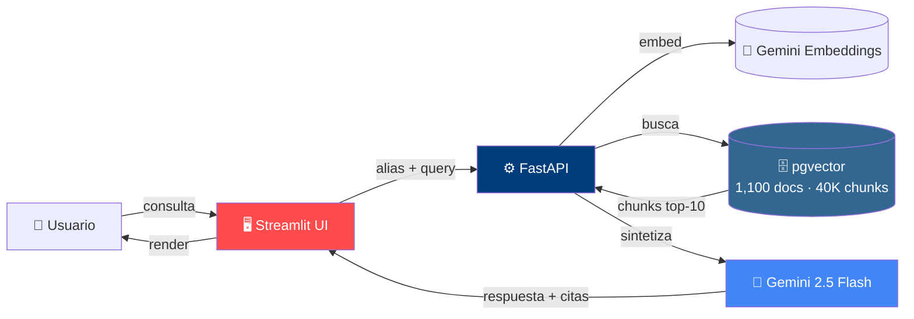
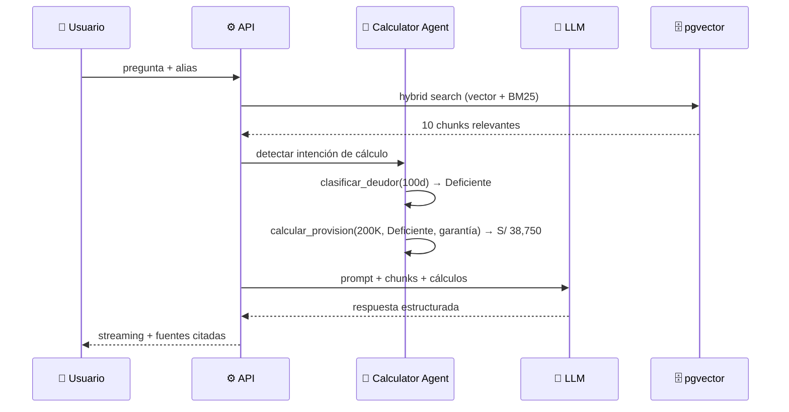
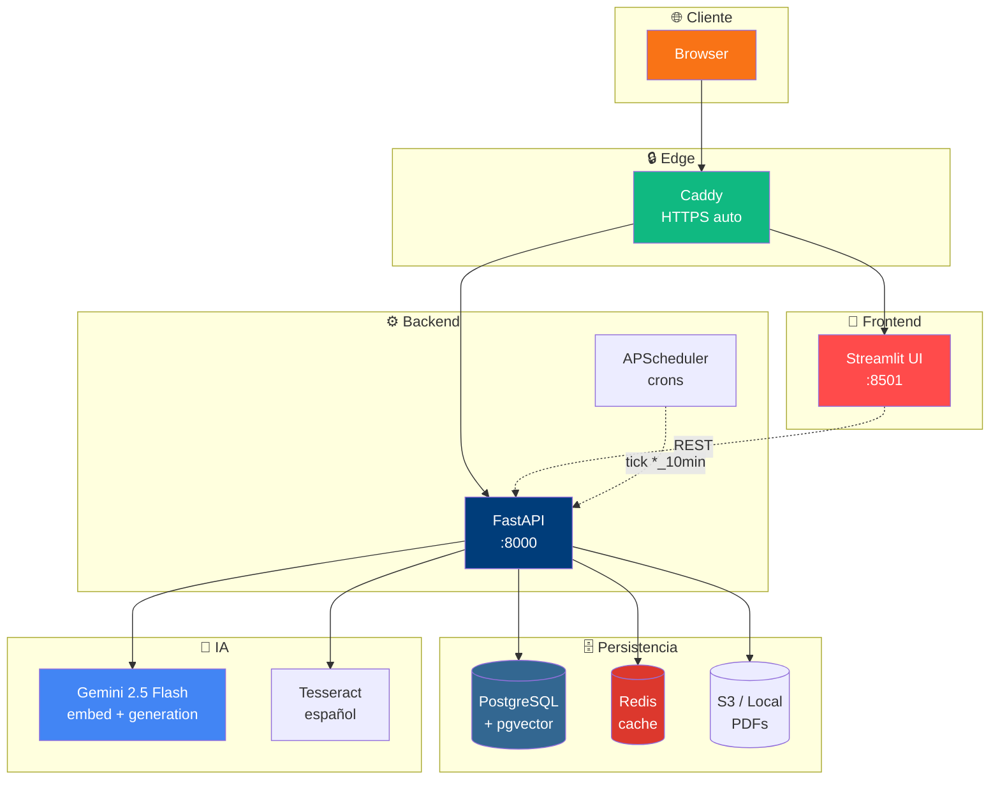
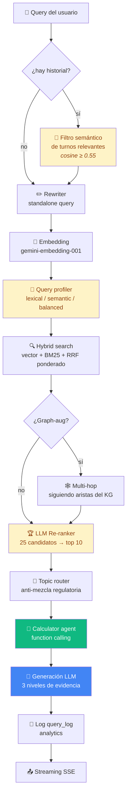

<h1 align="center">🏛️ RAG SBS</h1>
<h3 align="center">Mesa Experta Regulatoria Bancaria · Perú</h3>

<p align="center">
  <a href="https://3.220.87.49.nip.io"></a>
  <a href="#"></a>
  <a href="#"></a>
  
  
</p>

<p align="center">
  Sistema <b>RAG agéntico</b> sobre normativa financiera peruana —
  <code>SBS</code> · <code>BCRP</code> · <code>Congreso</code> · <code>MEF</code> · <code>SMV</code> · <code>SUNAT</code> · <code>INDECOPI</code> · <code>BIS</code> · <code>BID</code> · <code>BN</code> · <code>COFIDE</code> · <code>AgroBanco</code>
</p>

---

## ⚡ Vista en 30 segundos



## 🎯 ¿Qué hace?

Responde preguntas técnicas de banca peruana **con cita literal de la fuente oficial PDF** y para cálculos numéricos invoca **funciones deterministas** (no alucina).

### Ejemplo en vivo

> **Usuario:** *"Hipotecario S/ 200,000, atraso 100 días, garantía S/ 180,000. ¿Qué hago?"*



**Respuesta del sistema:**
- ✅ Clasificación: **Deficiente** (Res SBS 11356-2008, Cap. II num. 4.3)
- ✅ Provisión: **S/ 38,750**
- ✅ Tabla regulatoria con fila resaltada
- ✅ Cita literal del PDF

---

## 📊 Estado del sistema (junio 2026)

<table>
<tr>
<td>

**Corpus**
| Métrica | Valor |
|---|---|
| 📄 Documentos | **1,100** |
| 🧩 Chunks | **40,161** |
| 🏛️ Instituciones | **12** |
| 🕸️ Aristas grafo | **~12,000** |
| 🎯 Tópicos | **15** |

</td>
<td>

**Cobertura institucional**
| Institución | Docs |
|---|---|
| 🏦 SBS | ~210 |
| 💰 BCRP | ~67 |
| ⚖️ Congreso | ~75 |
| 🏛️ MEF | ~72 |
| 📈 SMV | ~27 |
| 💵 SUNAT | ~38 |
| 🛡️ INDECOPI | ~12 |
| 🌍 BIS / BID | 5 |

</td>
</tr>
</table>

---

## 🏗️ Arquitectura



---

## 🔬 Pipeline de query (8 fases)



---

## ✨ Capacidades clave (v0.5)

<table>
<tr>
<th>Categoría</th>
<th>Capacidad</th>
<th>Implementación</th>
</tr>
<tr>
<td rowspan="4">🔎<br/><b>Retrieval</b></td>
<td>Hybrid search adaptativo</td>
<td>Pesos vector/BM25 según perfil de query (4 modos)</td>
</tr>
<tr>
<td>Re-ranker LLM</td>
<td>25 candidatos → top 10 con prompt 5 niveles</td>
</tr>
<tr>
<td>Graph-augmented</td>
<td>Multi-hop sobre KG L1 (citas) + L2 (tópicos)</td>
</tr>
<tr>
<td>Topic router</td>
<td>Anti-mezcla: provisiones ≠ patrimonio ≠ LAFT</td>
</tr>
<tr>
<td rowspan="3">🧠<br/><b>Memoria</b></td>
<td>Filtro semántico de contexto</td>
<td>Embeddings filtran turnos relevantes a query actual</td>
</tr>
<tr>
<td>Persistente por alias</td>
<td>Recupera últimas 20 conversaciones al login (opt-in)</td>
</tr>
<tr>
<td>Detector acrónimos ambiguos</td>
<td>RCD/PDD/RPC/SAR → desambigua antes de consultar</td>
</tr>
<tr>
<td rowspan="3">📥<br/><b>Ingesta</b></td>
<td>Parser de 3 niveles</td>
<td>PyMuPDF → pypdf → <b>OCR Tesseract español</b></td>
</tr>
<tr>
<td>Chunker estructural</td>
<td>Detecta jerarquía SBS (Cap > Sec > Art > Anexo)</td>
</tr>
<tr>
<td>Worker autónomo + caps</td>
<td>$9.50 USD / $1.50 diarios / 2000 docs / hasta junio</td>
</tr>
<tr>
<td rowspan="3">⚙️<br/><b>Operación</b></td>
<td>Self-healing</td>
<td>Cron <code>*/15</code> mata runs zombies > 30 min</td>
</tr>
<tr>
<td>Analytics por usuario</td>
<td>Log de consultas + dashboard drill-down</td>
</tr>
<tr>
<td>Discovery continuo</td>
<td>Cron diario 03:00 UTC busca PDFs nuevos</td>
</tr>
<tr>
<td rowspan="2">🎨<br/><b>UX</b></td>
<td>Wizard de consulta</td>
<td>Rol + caso + objetivo → query estructurada</td>
</tr>
<tr>
<td>Chat estilo conversación</td>
<td>Burbujas alineadas, modo usuario vs técnico</td>
</tr>
</table>

---

## 🚀 Quickstart

### Desarrollo local

```bash
cp .env.example .env
# Editar: GOOGLE_API_KEY=...

docker compose up -d

# Aplicar migraciones (001 → 005)
for m in sql/migrations/*.sql; do
  docker exec rag-sbs-postgres psql -U rag -d ragdb -f /sql/migrations/$(basename $m)
done

# Seed catálogo + scan
curl -X POST http://localhost:8000/v1/ingest/seed
curl -X POST http://localhost:8000/v1/ingest/scan -d '{}' -H 'Content-Type: application/json'

# UI en http://localhost:8501
```

### Producción AWS Lightsail

```bash
ssh ubuntu@<vm-ip> "bash <(curl -fsSL https://raw.githubusercontent.com/eurrutia/rag-sbs/main/scripts/lightsail/bootstrap.sh)"

# Editar .env.prod con GOOGLE_API_KEY, POSTGRES_PASSWORD, DOMAIN

docker compose -f docker-compose.prod.yml --env-file .env.prod up -d --build
```

---

## 📚 Stack

<p>


</p>

---

## 📖 Documentación

| Archivo | Contenido |
|---|---|
| [`docs/architecture.md`](docs/architecture.md) | Arquitectura técnica detallada con diagramas |
| [`docs/changelog.md`](docs/changelog.md) | Historial de versiones v0.1 → v0.5 |
| [`docs/roadmap.md`](docs/roadmap.md) | Hoja de ruta Fase 0 → Fase 10 |
| [`docs/casos-de-uso.md`](docs/casos-de-uso.md) | Casos demo end-to-end |
| [`docs/regulatorio.md`](docs/regulatorio.md) | Mapeo del corpus regulatorio |

🌐 Documentación web: [ecus.github.io/rag-sbs](https://ecus.github.io/rag-sbs)

---

## 💰 Costos operativos

| Concepto | USD/mes |
|---|---|
| AWS Lightsail VM 2GB + 2GB swap | $12 |
| Gemini 2.5 Flash (1K queries/día) | $5-10 |
| Dominio nip.io | $0 |
| **Total** | **~$20/mes** |

Cap de seguridad del worker: **$9.50 USD acumulado** (autoapagado).

---

## 👤 Autor

**Erik Urrutia** · eurrutia489@gmail.com

> Portafolio personal · Reutilizable bajo solicitud
