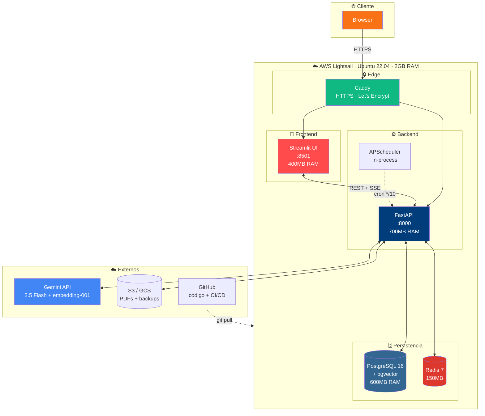
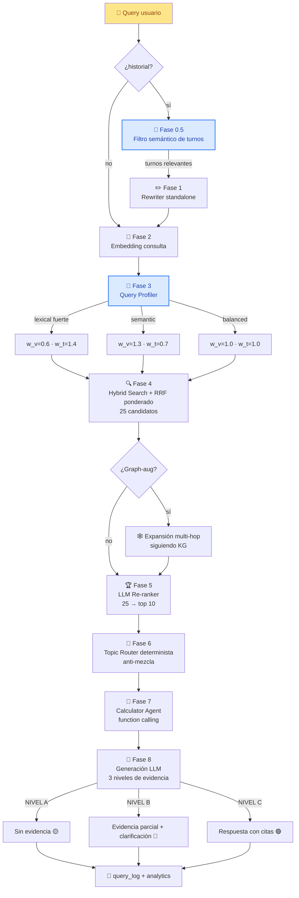
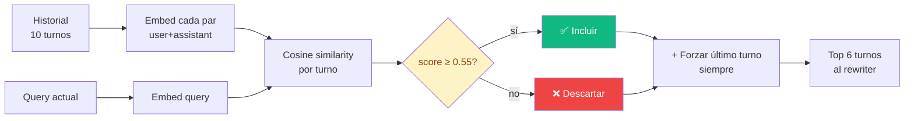
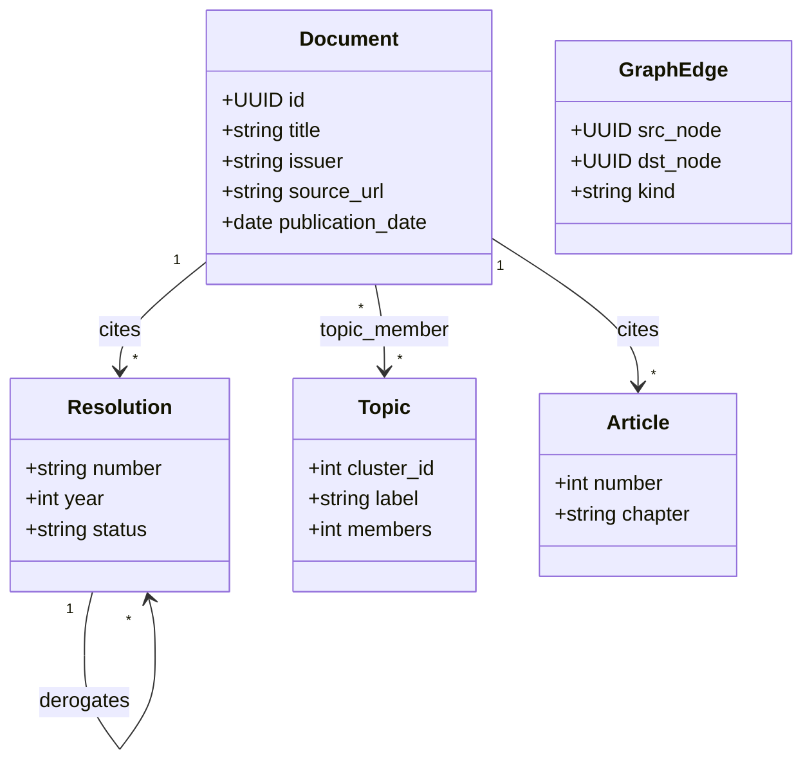
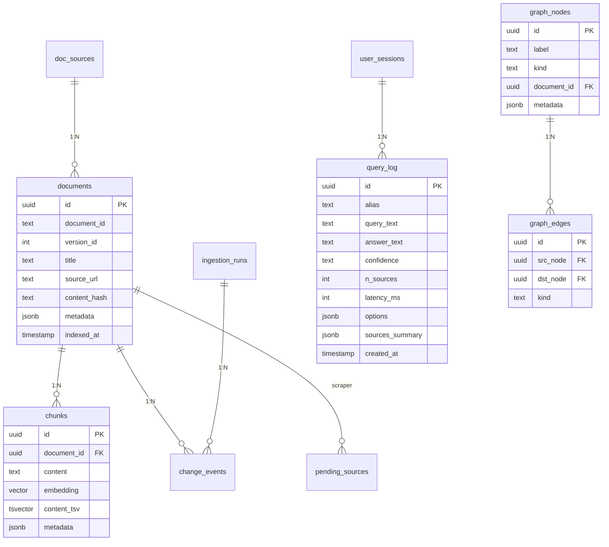
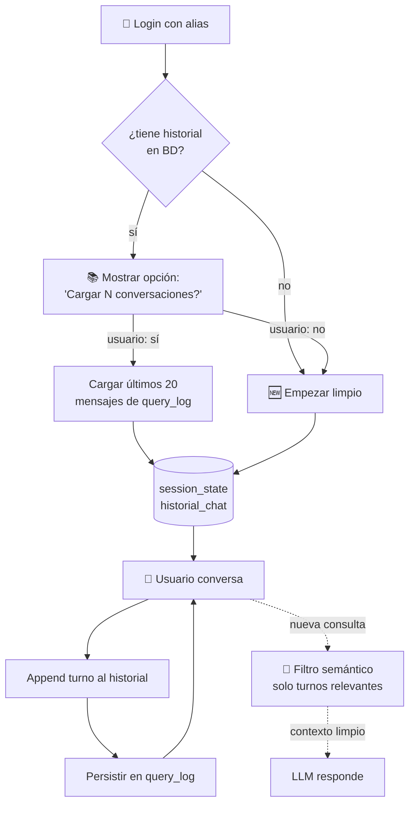
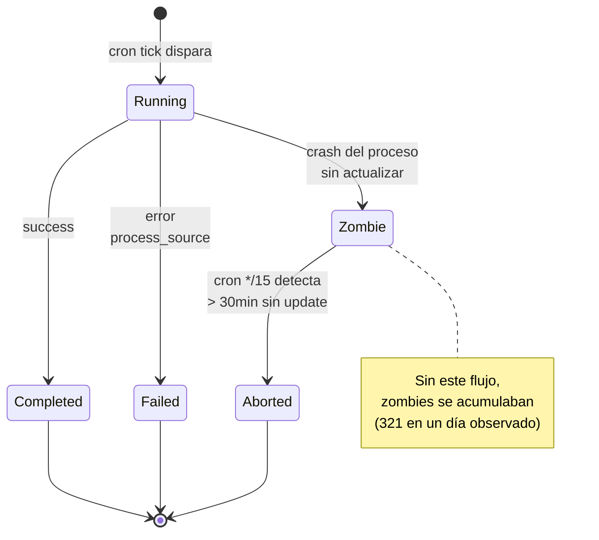

# 🏗️ Arquitectura técnica · v0.5

> Visión de ingeniería del sistema RAG SBS — qué corre dónde, cómo fluye una query, y por qué se diseñó así.

---

## 🎯 Objetivos de diseño

| Objetivo | Cómo se logra |
|---|---|
| **Zero alucinación numérica** | Calculator agent con funciones Python deterministas |
| **Citas verificables** | Hybrid search + reranker + cada fuente vinculada a PDF original |
| **Anti-mezcla regulatoria** | Topic router determinista basado en keywords |
| **Bajo costo operativo** | Stack en una VM 2GB · cap de gasto Gemini · scale-to-zero futuro |
| **Auto-mantenimiento** | Crons que limpian zombies, descubren docs nuevos y rebuildean grafo |
| **Memoria sin sesgo** | Filtro semántico de turnos relevantes vía embeddings |

---

## 🗺️ Vista de despliegue



---

## 🔬 Pipeline de query — 8 fases detalladas



### 🆕 Fase 0.5 — Filtro semántico de contexto



**Razón**: usuarios cambian de tema en conversaciones largas. Pasar siempre los últimos N turnos provoca contaminación de contexto (ej. RCD bajo lente de titulización). El filtro semántico solo pasa turnos relacionados con la nueva pregunta.

### 🎯 Fase 3 — Query Profiler

```mermaid
flowchart TB
    Q[Query] --> P{Patrón detectado}

    P -->|"Res SBS 11356-2008<br/>Art 5"| L2[Lexical fuerte<br/>2+ entidades]
    P -->|"Resolución 11356"| L1[Lexical simple<br/>1 entidad]
    P -->|"¿qué es...?"<br/>"¿cómo...?"| S[Semantic]
    P -->|sin señal clara| B[Balanced]

    L2 --> W2[w_vector=0.6<br/>w_texto=1.4]
    L1 --> W1[w_vector=0.8<br/>w_texto=1.2]
    S --> WS[w_vector=1.3<br/>w_texto=0.7]
    B --> WB[w_vector=1.0<br/>w_texto=1.0]
```

---

## 🕸️ Knowledge Graph



### Niveles del KG

| Nivel | Qué representa | Cómo se construye |
|---|---|---|
| **L1** Citas explícitas | Referencias entre normas | Regex sobre chunks: `Res. SBS N° XXXX-YYYY` |
| **L2** Tópicos semánticos | Agrupaciones temáticas | K-means sobre embeddings + LLM naming |

**Estado actual**: ~1,100 nodos `document` + 252 nodos `resolution` + 15 nodos `topic` + ~12,000 aristas `cites`.

---

## 📥 Pipeline de ingesta

```mermaid
flowchart LR
    SRC[Fuente PDF<br/>URL del catálogo] --> DL[📥 Downloader<br/>respeta robots.txt<br/>excepto .gob.pe]

    DL --> HASH[#️⃣ Hash<br/>SHA-256 contenido]
    HASH --> CACHE{¿hash cambió?}
    CACHE -->|no| SKIP[⏭️ Skip<br/>last_status=unchanged]
    CACHE -->|sí| PARSE

    PARSE[📄 Parser cadena 3 niveles]
    PARSE --> P1[1. PyMuPDF<br/>preserva tablas]
    P1 --> CHK1{¿texto ≥ 50 char/pág?}
    CHK1 -->|sí| OK
    CHK1 -->|no| P2[2. pypdf fallback]
    P2 --> CHK2{¿texto suficiente?}
    CHK2 -->|sí| OK
    CHK2 -->|no| P3[3. OCR Tesseract<br/>español · DPI 200]
    P3 --> OK[✅ Texto extraído]

    OK --> CHUNK[✂️ Chunker estructural<br/>detecta Cap → Sec → Art → Anexo]
    CHUNK --> EMB[🧠 Embedding<br/>768d por chunk]
    EMB --> STORE[(💾 chunks table<br/>+ tsvector BM25)]

    STORE --> KG[🕸️ Update KG<br/>extrae citas y enlaza]

    style P3 fill:#fef3c7,color:#92400e
    style CHUNK fill:#dbeafe,color:#1e40af
    style EMB fill:#4285f4,color:#fff
```



---

## ⏰ Crons automáticos

```mermaid
gantt
    title Cronograma de tareas automáticas (UTC)
    dateFormat HH:mm
    axisFormat %H:%M

    section Cada 10 min
    Worker tick (pending_sources) :crit, w1, 00:00, 10m
    Worker tick :crit, w2, 00:10, 10m
    Worker tick :crit, w3, 00:20, 10m

    section Cada 15 min
    Zombie cleanup :z1, 00:00, 15m
    Zombie cleanup :z2, 00:15, 15m

    section Cada hora
    Rebuild grafo + tópicos :g1, 00:05, 5m

    section Diario 03:00
    Discovery scrapers SBS+BCRP :d1, 03:00, 30m

    section Diario 04:00
    Backup pg_dump → S3 :b1, 04:00, 15m
```



---

## 💾 Capa de datos



---

## 🤖 Arquitectura de memoria conversacional



**Diferencia clave con sistemas tradicionales**:
- ❌ Tradicional: pasa últimos N turnos siempre → contamina contexto
- ✅ RAG SBS: filtra por similitud semántica → solo turnos relevantes

---

## 🎚️ Self-healing



---

## 🚀 Decisiones arquitectónicas (ADRs)

| ID | Decisión | Razón |
|---|---|---|
| **ADR-001** | Gemini sobre Ollama | Latencia + calidad >> costo en escala portafolio |
| **ADR-002** | pgvector sobre Pinecone/Weaviate | Simplicidad: una sola BD relacional |
| **ADR-003** | APScheduler in-process sobre Celery | Stack 5x más simple para 1 worker |
| **ADR-004** | RRF ponderado sobre concatenación | Documentado en literatura, mejor ranking |
| **ADR-005** | LLM reranker sobre cross-encoder local | Evita +3GB de sentence-transformers |
| **ADR-006** | Topic router determinista | Zero falsos positivos en separación regulatoria |
| **ADR-007** | Caps de costo hard-coded al worker | Presupuesto portafolio limitado |
| **ADR-008** | Self-healing cron sobre supervisión manual | Experiencia: 321 zombies/día sin esto |
| **ADR-009** | Filtro semántico de contexto memoria | Resolver contaminación en cambios de tema |
| **ADR-010** | Plan C: max_tokens 6K-8K, chunks 10 | Aprovechar context window Gemini (1M) |

---

## 📊 Métricas operativas

| Métrica | Valor actual | Meta v1.0 |
|---|---|---|
| Latencia query P50 | 4-8s | <5s |
| Latencia query P95 | 15s | <10s |
| Confianza ALTA real | ~70% | >85% |
| Costo por query | ~$0.005 | <$0.003 |
| Uptime | 99.5% | 99.9% |
| Corpus | 1,100 docs | 2,000+ |
| Instituciones | 12 | 15+ |
