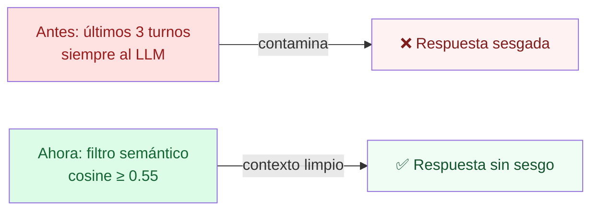
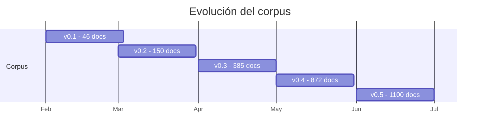

# 📝 Changelog

> Historial detallado de cambios v0.1 → v0.5

---

## 🔥 v0.5 — junio 2026 (current)

### Phase 7 — Memoria semánticamente filtrada

- ✨ **`src/agents/memory_relevance.py`**: filtro semántico de turnos del historial
- ✨ Plan C: límites de memoria/contexto subidos 3x
  - Historial al rewriter: 3 → **10 turnos**
  - Caracteres por mensaje: 400 → **1,500**
  - Memoria persistente: 6 → **20 mensajes**
  - Chunks pre-rerank: 18 → **25**
  - Chunks finales: 7 → **10**
  - Output normal: 4,000 → **6,000 tokens**
  - Output informe: 6,000 → **8,000 tokens**
- ✨ Telemetría: evento SSE `memory_filter` con scores por turno

### Phase 6 — Calidad de respuestas

- 🐛 **Fix anti-NIVEL-B agresivo**: el LLM era excesivamente conservador, decía "no tengo evidencia" incluso con 5-7 fuentes relevantes
- ✨ Permitir **ejemplos didácticos con números hipotéticos** (etiquetados como `(ejemplo hipotético)`)
- ✨ Preguntas conceptuales (qué es X, definición de Y) no requieren cita literal, se sintetiza
- ✨ Badge de confianza **honesto**: ahora muestra `SIN EVIDENCIA` y `EVIDENCIA PARCIAL` en lugar de `ALTA` falsa
- ✨ Nueva función `_confianza_final()` combina retrieval score con calidad de respuesta

### Phase 5.5 — Crecimiento corpus

- 📦 **+106 documentos** (994 → 1,100)
- 🆕 **3 instituciones nuevas**: Banco de la Nación, COFIDE, AgroBanco
- ✨ Catálogo v6, v7, v8 con 70+22+35 fuentes nuevas
- ✨ Memorias Anuales SBS 2017-2024
- ✨ Informes SUNAT tributación bancaria (ITF, IGV)
- ✨ Reglamentos COOPAC y Manual Contabilidad por niveles

### Operación

- 🛡️ Defensa contra OOM: `mem_limit` por container + 2GB swap en VM
- 🛡️ Self-healing: cron */15 limpia runs zombies (321 acumulados en un día!)
- ✨ Cron diario 03:00 UTC: discovery automático de URLs nuevas

### Bug fixes

- 🐛 `name 'logger' is not defined` en routes_query.py
- 🐛 `StreamlitDuplicateElementKey` (botones con misma key)
- 🐛 Columna `Año` mixta int/str rompía PyArrow
- 🐛 Stream endpoint no loggeaba queries (solo no-streaming)
- 🐛 Memoria opt-out resetea correctamente entre sesiones

### Seguridad

- 🚨 **Removidas keys accidentalmente committeadas** (API key Google)
- ✨ `.gitignore` para `keys`, `*.pem`, `*.key`, `.env*`

---

## v0.4 — mayo 2026

### Phase 5 — Analytics + memoria persistente

- ✨ **Alias de usuario obligatorio** al entrar
- ✨ Memoria persistente: recupera últimas N conversaciones al login
- ✨ Tabla `user_sessions` + `query_log` (SQL migration 005)
- ✨ Endpoints `/v1/analytics/*` con drill-down por usuario
- ✨ Dashboard de analytics en modo técnico
- ✨ **Wizard "Asistente para formular consulta"** (rol + caso + objetivo)
- ✨ Modo usuario vs modo técnico (toggle en sidebar)
- ✨ Chat estilo conversación (burbujas alineadas)
- ✨ Tabs renombrados (Consultar / Tópicos / Mapa regulatorio)
- ✨ Grafo más espaciado (default 250 vs 130, repulsión 9000 vs 3500)
- 🐛 Fix: contradicción "Confianza ALTA" + "no tengo evidencia"
- 🐛 Fix: español peruano neutro en LLM (sin voseo)
- 🐛 Fix: contador documentos sidebar lee live de `documents` table

### Phase 4 — Retrieval avanzado

- ✨ **Hybrid search adaptativo**: `query_profile.py` detecta perfil
- ✨ **LLM Re-ranker mejorado**: 5 niveles de discriminación
- ✨ **OCR fallback** con Tesseract español
- ✨ Cadena de parser 3 niveles: PyMuPDF → pypdf → OCR

### Phase 3 — Manual de Contabilidad SBS

- ✨ 16 PDFs del Manual completo (Cap I-IV vigencias 2024-2026)
- ✨ Res 895-98 fundacional (manual histórico)
- ✨ Modificatorias: 682-2019, 349-2021, 7197-2012, 3932-2022

---

## v0.3 — abril 2026

### Phase 2 — Corpus multiinstitucional

- 📦 Catálogo v2-v4: 311 → 385 fuentes
- 🆕 +SUNAT, +INDECOPI, +BIS, +BID
- ✨ Web scrapers HTML
- ✨ Worker background con caps ($9.50/$1.50)

### Mejoras UI institucionales

- ✨ Badges institucionales en cards de fuentes
- ✨ Coloreo de nodos grafo por institución emisora
- 🐛 Fix BCRP `document_id` duplicate key
- 🐛 Fix robots.txt bloquea SBS Portals/0

---

## v0.2 — marzo 2026

### Phase 1 — Deploy AWS Lightsail

- ✨ Ubuntu 22.04, 2GB RAM, $12/mes
- ✨ Caddy + nip.io + Let's Encrypt
- ✨ Backups pg_dump → S3
- ✨ Migración a Gemini 2.5 Flash
- ✨ Object Store abstracto (S3/GCS/local)

---

## v0.1 — febrero 2026

### Phase 0 — Demo técnica

- ✨ FastAPI + Streamlit MVP
- ✨ pgvector hybrid search + RRF
- ✨ Knowledge graph L1 + L2
- ✨ Calculator agent (function calling)
- ✨ Topic router determinista
- ✨ Parser PyMuPDF + pypdf
- ✨ Chunker estructural
- ✨ Validación contra fuente oficial

---

## 📊 Crecimiento del corpus

| Versión | Documentos | Chunks | Instituciones |
|---|---|---|---|
| v0.1 | 46 | 1,400 | 1 (SBS) |
| v0.2 | 150 | 4,500 | 2 (+BCRP) |
| v0.3 | 385 | 11,500 | 9 |
| v0.4 | 872 | 28,195 | 9 |
| **v0.5** | **1,100** | **40,161** | **12** |

---

## 🎯 Política de versionado

- **MAJOR** (1.0 → 2.0): cambios de arquitectura (GCP, multi-tenant)
- **MINOR** (0.4 → 0.5): nuevas features funcionales
- **PATCH** (0.5.1): bug fixes y mejoras pequeñas
