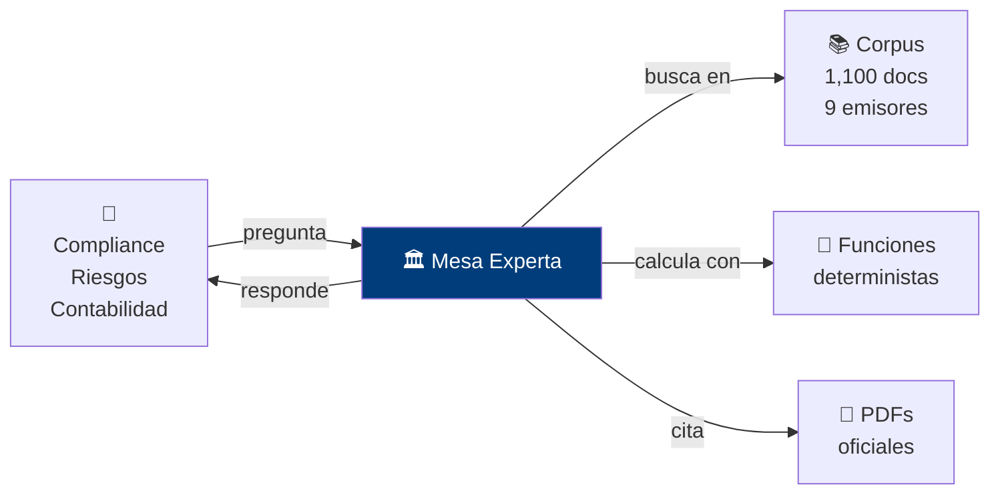
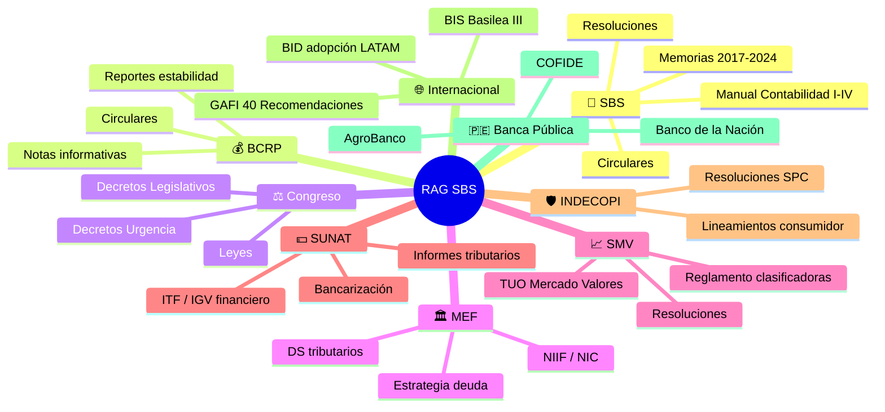
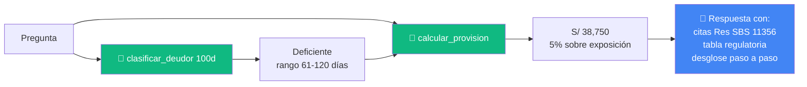
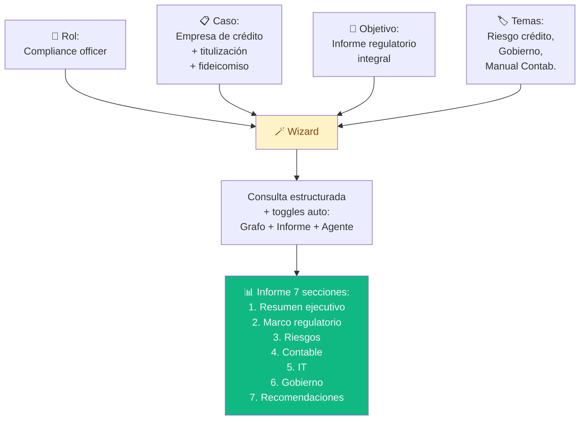
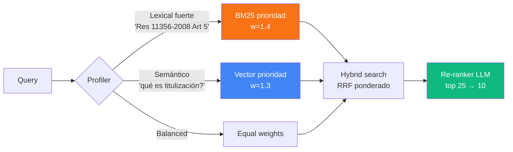
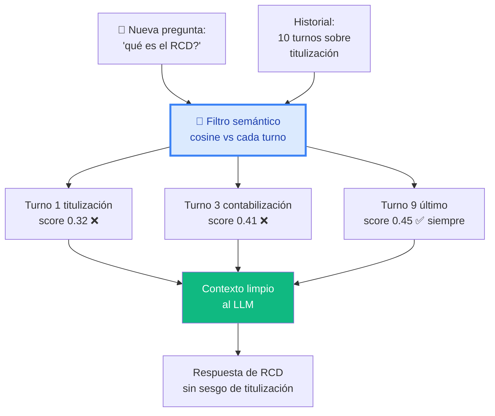

<h1 align="center">🏛️ RAG SBS</h1>
<h3 align="center">Mesa Experta Regulatoria Bancaria · Perú</h3>

  <strong>1,100 documentos</strong> · <strong>40,161 chunks</strong> · <strong>12 instituciones</strong>

  <a href="https://3.220.87.49.nip.io">🌐 <strong>Demo en vivo</strong></a> ·
  <a href="https://github.com/eurrutia/rag-sbs">📦 GitHub</a> ·
  <a href="architecture.md">🏗️ Arquitectura</a> ·
  <a href="changelog.md">📝 Changelog</a>

---

## 🎯 ¿Qué es?

Una **mesa experta regulatoria** que responde consultas técnicas de banca peruana **citando la fuente oficial PDF** y realizando **cálculos numéricos deterministas** (sin alucinación).

---

## 🌍 Cobertura institucional

---

## ⚡ Ejemplo 1 — Cálculo regulatorio

> **Usuario**: *"Hipotecario S/ 200,000, atraso 100 días, garantía S/ 180,000. ¿Qué hago?"*

---

## 🆚 Ejemplo 2 — Anti-alucinación

> **Usuario**: *"¿Cuál es la tasa de provisión hipotecaria para CPP?"*

<table>
<tr>
<th>Sistema</th>
<th>Respuesta</th>
<th>Veredicto</th>
</tr>
<tr>
<td>Gemini directo</td>
<td>"0.63%"</td>
<td>❌ Inventado</td>
</tr>
<tr>
<td><strong>RAG SBS</strong></td>
<td>"2.50% con garantía preferida / 5.00% sin garantía" <i>fuente: Res. SBS 11356-2008 Cap. III</i></td>
<td>✅ Verificable</td>
</tr>
</table>

---

## 🧠 Ejemplo 3 — Caso integral

Para casos complejos hay un **wizard** que arma la consulta estructurada:

**Output real obtenido**: 7 fuentes citadas (scores 0.70–0.90), confianza ALTA, 15s latencia, incluye Res SBS 1308-2013, 3780-2011, 14354-2009, 1010-99, 3986-2024.

---

## ✨ Capacidades v0.5

### 🔎 Retrieval inteligente

### 🧠 Memoria sin sesgo

### 🔍 Detector de acrónimos

Para acrónimos ambiguos comunes (RCD, PDD, RPC, SAR, GIR, etc.) el sistema pregunta antes de buscar:

> ⚠️ Detecté `RCD`. ¿A cuál te referís?
>
> - 📋 **Reporte Crediticio de Deudores** — Res SBS 11356-2008
> - 💱 **Riesgo Cambiario Crediticio** — Res SBS 774-2025
> - 🛡 **Reglamento de Conducta de Mercado** — Res SBS 3274-2017

---

## 🏗️ Stack técnico

Detalle completo en [Arquitectura](architecture.md).

---

## 📚 Documentos del proyecto

- 🏗️ [**Arquitectura técnica**](architecture.md) — Diagramas, ADRs, pipeline detallado
- 📝 [**Changelog**](changelog.md) — Historial v0.1 → v0.5
- 🗺️ [**Roadmap**](roadmap.md) — Fase 0 → Fase 10
- 📋 [**Casos de uso**](casos-de-uso.md) — Demos end-to-end
- 🏛️ [**Mapeo regulatorio**](regulatorio.md) — Corpus por área

---

## 👤 Sobre el autor

**Erik Urrutia** — Ingeniero, consultor regulatorio.

Este sistema es **portafolio personal** que demuestra:
- 🎯 RAG production-grade con cero alucinación numérica
- 🧠 Memoria conversacional sin sesgo (filtro semántico)
- 🕸️ Knowledge graph navegable con ~12K aristas
- 🛡️ Self-healing y observabilidad operacional
- 💰 Costos controlados (~$20/mes total)

📧 [eurrutia489@gmail.com](mailto:eurrutia489@gmail.com)
